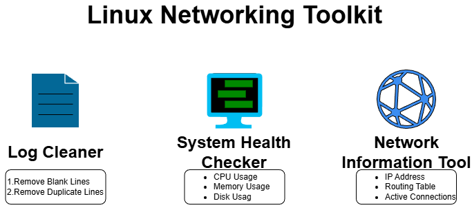

# Linux Networking Toolkit

A lightweight toolkit that provides essential Linux, system, and networking utilities for DevOps.

## Features
- 1.System Health Checker (`syscheck.sh`)
	- Shows CPU, memory, and disk usage
	- Lists running services
	- Displays system uptime

- 2.Network Information Tool (`netinfo.sh`)
	- Shows IP address
	- Displays routing table
	- Lists active network connections

- 3.Log Cleaner (`logclean.py`)
	- Removes blank lines
	- Removes duplicate lines
	- Outputs a cleaned version of the log file

## Usage
- Run system check:
	- `bash syscheck.sh`

- Run network info:
	- `bash netinfo.sh`

- Clean a log file:
	- `python3 logclean.py sample-logs/app.log`

## Requirements
- Linux environment
- Bash
- Python 3
